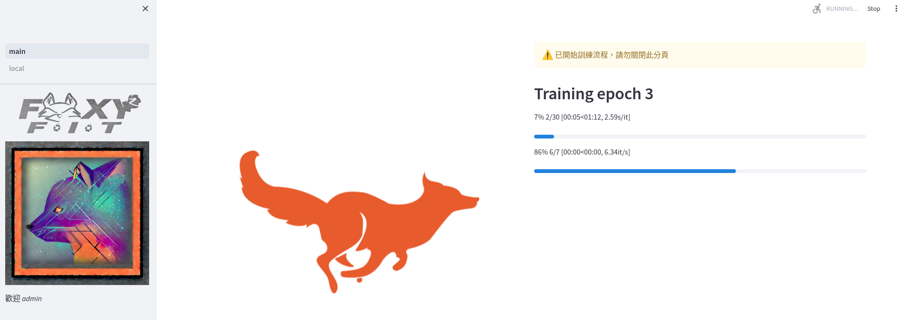
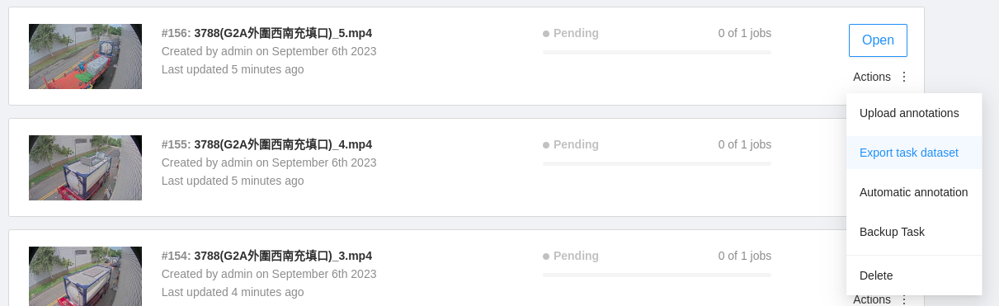
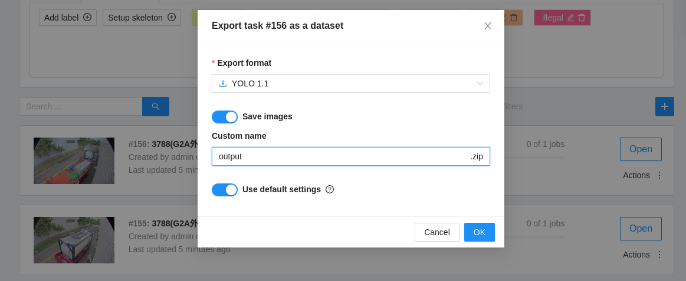
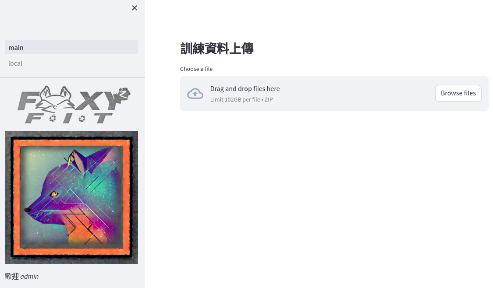

# FOXY_FIT
### 使用Streamlit編寫的YOLOv5訓練UI,可直接上傳CVAT輸出進行模型訓練。


## 套件安裝
```
pip install -r requirements-1.txt
pip install -r requirements-2.txt --extra-index-url https://download.pytorch.org/whl/cu113
git clone https://github.com/bensonbs/FOXY_FIT
```

## 建立訓練資料



## 啟動方法

```
streamlit run main.py
```


